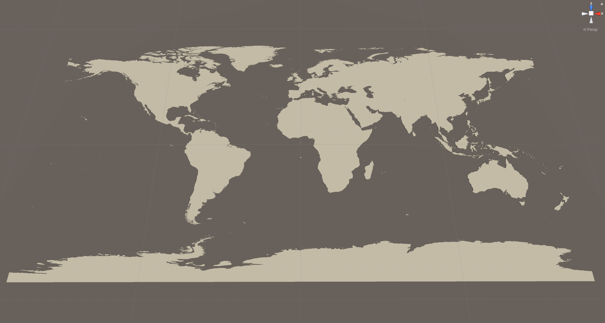
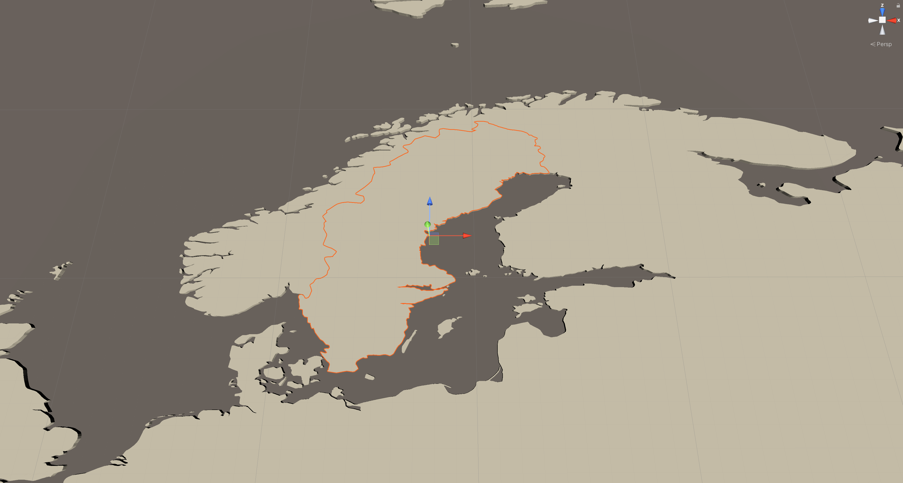

# Unity - rworldmap import

The purpose of this project is to illustrate the workflow of exporting vector data representing Earth's countries from the R package *rworldmap*, generate C# classes that can be used in Unity3D, and finally visualize the data in Unity3D accordingly as extruded polygons (prisms).

### Table of contents
* [Features](#Features)
* [Dependencies](#Dependencies)
* [How to use](#How-to-use)
* [License](#License)

## Features

* R script required to access and generate all `Vector2` country data from the *rworldmap* package.
* Unity3D script to visualize all country data as individual `GameObjects`.
* comprehensive documentation across all source files

## Dependencies

This project has been built using the following specifications:

* [Unity3D](https://unity3d.com) 2020.2.1f1 Personal
* [Unity - PolyExtruder](https://github.com/nicoversity/unity_polyextruder) (cloned on 2021-02-02)
* [R](https://www.r-project.org) 4.0.3
* [RStudio](https://www.rstudio.com) 1.4.1103 (OS X)
* [rworldmap](https://cran.r-project.org/web/packages/rworldmap/) (accessed on 2021-02-02)

## How to use

Please note that the compiled data from the *rworldmap* **is not** included in this repository. Please follow the instructions below to access and compile yourself the data for own use.

### 1. R - Access country data and generate C# files

All source code can be found within the `r_src` directory of this repository. Carefully investigate the `rworldmap_export_to_unity.R` file to follow the implementation.

1. Copy the `rworldmap_export_to_unity.R` file into your R default working directory.
2. Inside your R default working directory, create a new directory with the name `rworldmap-unity-files`.
3. Open RStudio, and open the `rworldmap_export_to_unity.R` file.
4. Ensure that you have the *rworldmap* package installed. Potentially, run `install.packages("rworldmap")`.
5. Run all contents of the `rworldmap_export_to_unity.R`.
6. All C# mesh data files will be generated and placed into your `rworldmap-unity-files` directory (see step 2).
7. Additionally to the mesh data files, you will find a file named `_init.cs` containing the C# initialization code snippet (to be later copied into the `WorldGenerator.cs` script; see further Unity3D related steps below).

### 2. Unity3D - Use generated C# files

All source code can be found within the `unity_src` directory of this repository. Carefully investigate the `WorldGenerator.cs` file to follow the implementation.

1. Create a new Unity3D 3D project.
2. Import the [Unity - PolyExtruder](https://github.com/nicoversity/unity_polyextruder) package to your project.
3. Import the `WorldGenerator.cs` and `IRWMMeshData.cs` scripts to your project.
4. In your Unity scene, create a new empty GameObject (make sure its properties are `reset`), and attach the imported `WorldGenerator.cs` script as a component.
5. Import all generated mesh data files from your `rworldmap-unity-files` directory to your project (except for the `_init.cs` script).
6. Open the `WorldGenerator.cs` script, and copy all contents of the `_init.cs` script to the marked location inside the `Awake()` function.
7. Run your Unity3D application. All created country GameObjects are attached as Child GameObjects to the GameObject that has the `WorldGenerator.cs` as a component attached.
8. For further configuration of the extruded country polygons, please refer to the [Unity - PolyExtruder](https://github.com/nicoversity/unity_polyextruder) documentation.

## Screenshots

#### Country data visualized as extruded polygons in Unity3D: World map

#### Country data visualized as extruded polygons in Unity3D: Sweden selected in scene view

## License
MIT License, see [LICENSE.md](LICENSE.md)